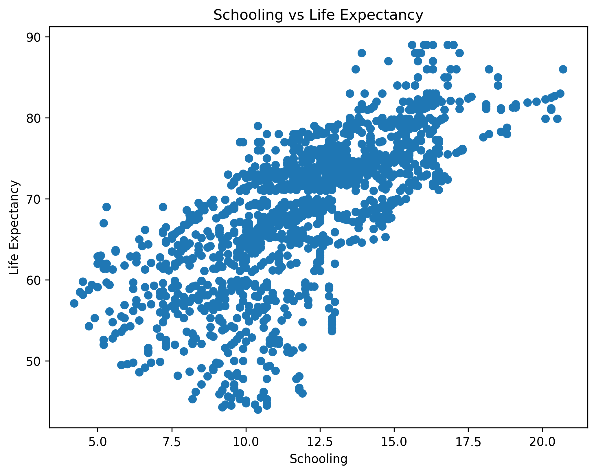
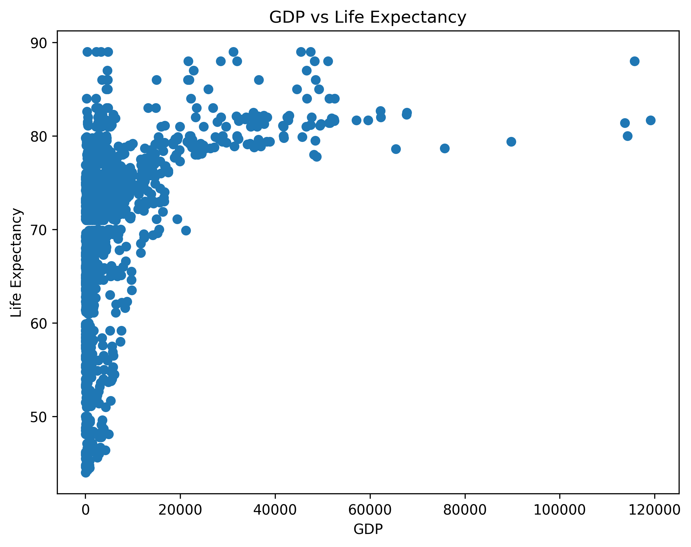
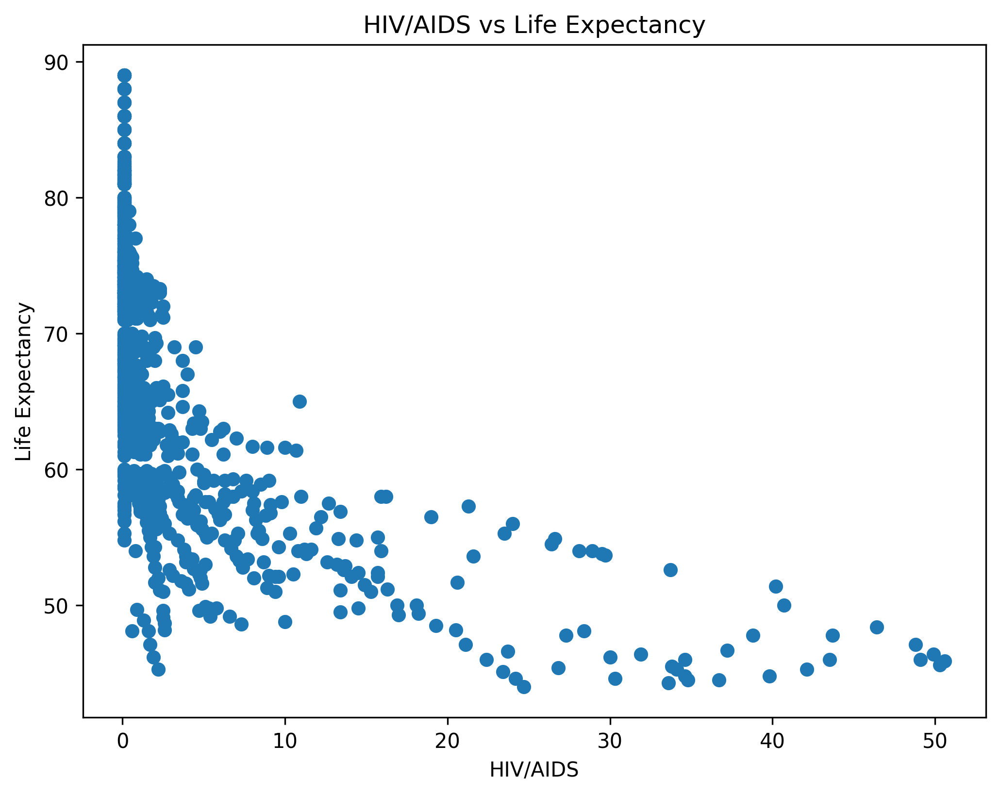

# Life Expectancy Prediction

## About the Project

This project uses machine learning to predict life expectancy based on health, economic, and social factors.

The project uses a real-world dataset containing information about countries and health-related indicators.

## Technologies

- Python
- Pandas
- Scikit-learn
- Matplotlib

## Machine Learning Model

A Linear Regression model is used to predict life expectancy.

The dataset is divided into training and testing sets. The model is evaluated using:

- Mean Absolute Error (MAE)
- R² Score

## Results

- MAE: 2.8 years
- R² Score: 0.81

These results are based on the test set used in this project.

## Project Status

Completed basic machine learning model and evaluation.
## Data Analysis

The project also explores relationships between different factors and life expectancy.

### Schooling vs Life Expectancy

This visualization explores the relationship between schooling and life expectancy.

### GDP vs Life Expectancy

This visualization explores the relationship between GDP and life expectancy.

### HIV/AIDS vs Life Expectancy

This visualization explores the relationship between HIV/AIDS and life expectancy.

## Model Evaluation

The Linear Regression model achieved:

- Mean Absolute Error (MAE): 2.8
- R² Score: 0.81

The model was evaluated using a separate test set that was not used during training.
## What I Learned

Through this project, I learned how to:

- Work with a real-world dataset.
- Clean and prepare data for machine learning.
- Split data into training and testing sets.
- Build a Linear Regression model.
- Evaluate a machine learning model using MAE and R².
- Visualize relationships between variables.
- Document and publish a machine learning project on GitHub.

## Future Improvements

In future versions, I would like to:

- Test different machine learning algorithms.
- Improve the model's performance.
- Perform more detailed feature analysis.
- Experiment with additional data preprocessing techniques.
- Compare different models and their results.
